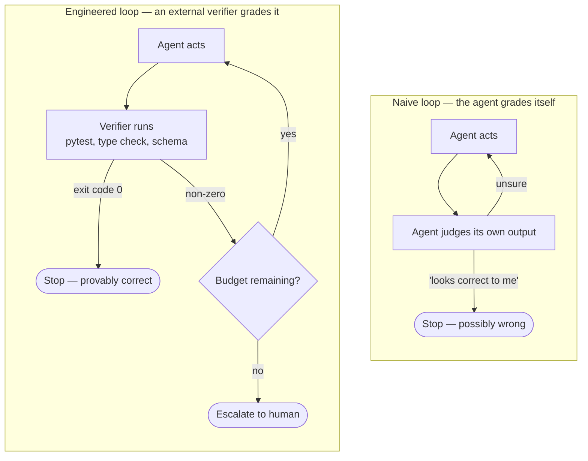
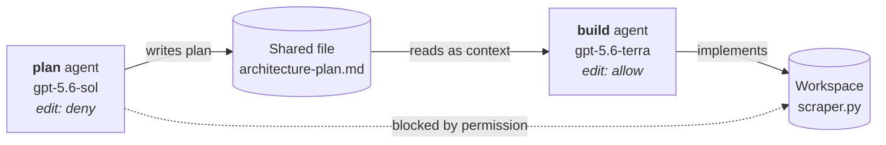
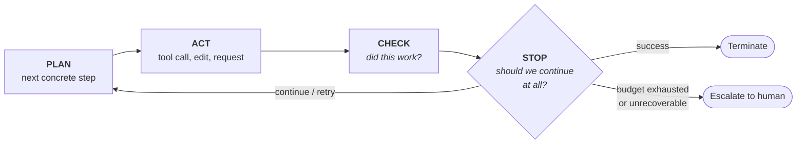
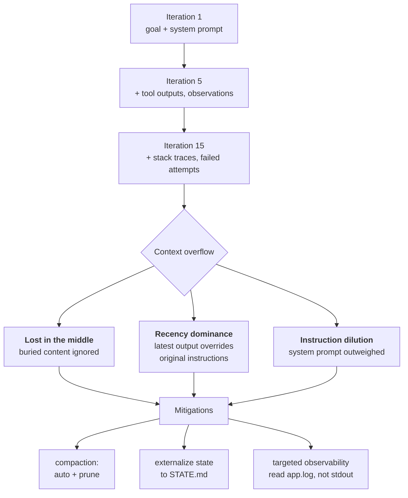
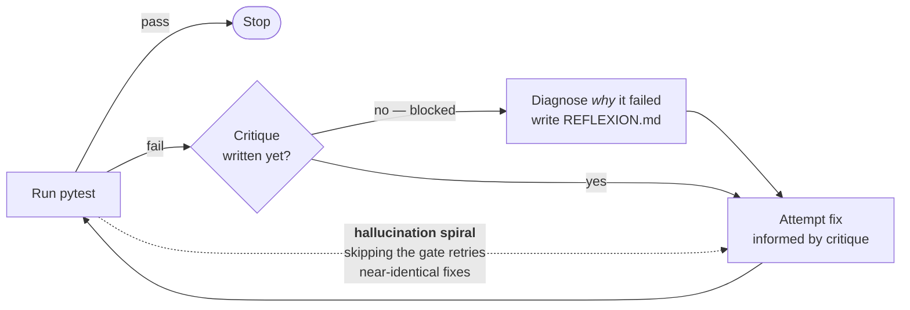
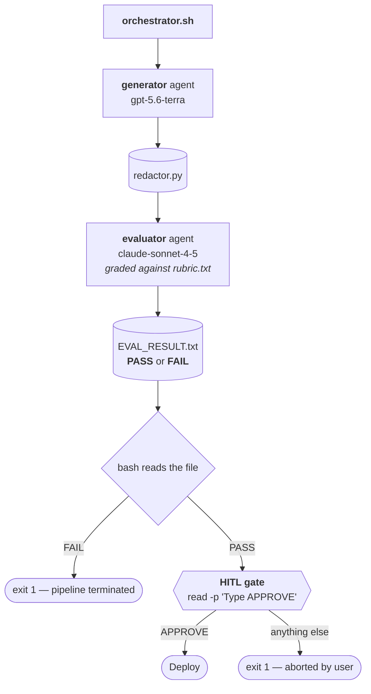
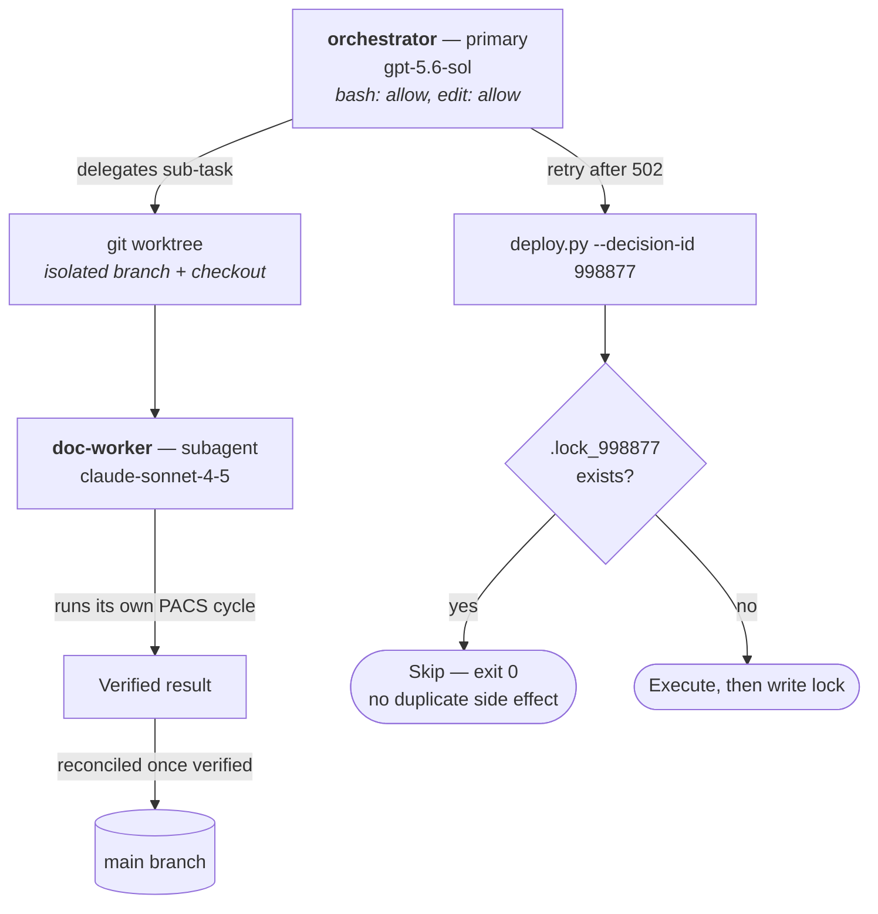
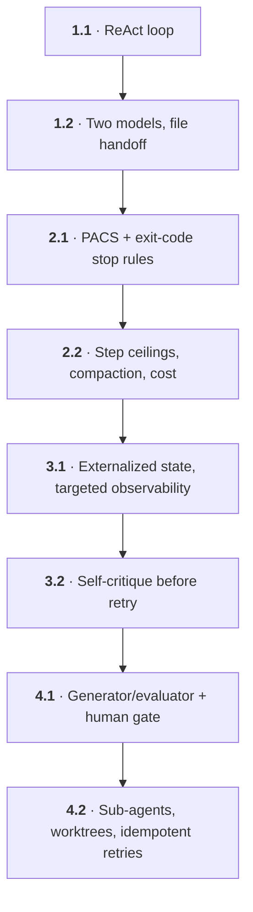

# Loop Engineering — 2-Day Course

Building autonomous, self-correcting agentic loops with the **OpenCode CLI** on **AWS Bedrock**.

The course moves from single-turn prompting to production-grade loop systems: how a loop is structured (PACS), how it is bounded (stop rules, circuit breakers, budgets), how it stays coherent over long runs (state externalization, context pruning, Reflexion), and how loops compose into multi-agent topologies with human gates.

```mermaid
flowchart LR
    subgraph D1["DAY 1 — make it safe and bounded"]
        direction TB
        M1["Module 1<br/>Shift to Loop Engineering"] --> L11["Lab 1.1<br/>First autonomous loop"]
        L11 --> L12["Lab 1.2<br/>Multi-model handoff"]
        L12 --> M2["Module 2<br/>The Control Plane"]
        M2 --> L21["Lab 2.1<br/>PACS and stop rules"]
        L21 --> L22["Lab 2.2<br/>Circuit breakers and cost"]
    end
    subgraph D2["DAY 2 — make it durable and composable"]
        direction TB
        M3["Module 3<br/>State and Context"] --> L31["Lab 3.1<br/>State tracking"]
        L31 --> L32["Lab 3.2<br/>Reflexion"]
        L32 --> M4["Module 4<br/>Advanced Topologies"]
        M4 --> L41["Lab 4.1<br/>Orchestrator and HITL"]
        L41 --> L42["Lab 4.2<br/>Worktrees and idempotency"]
    end
    L22 --> M3
```



---

## Repository contents

| Folder | Contents |
| --- | --- |
| `Modules/` | 4 lecture decks — the conceptual backbone |
| `Labs/` | 8 hands-on lab guides — one or two per module |

All material ships as PDF. To read a file from the terminal:

```bash
pdftotext "Labs/Lab 1.1 — Introduction to OpenCode and Autonomous Loops.pdf" - | less
```

Filenames contain spaces and em-dashes — always quote them.

---

## Requirements and prerequisites

### Who this course is for

Engineers who already write and ship code, and now want to build systems that let a model work unattended. The labs assume you are comfortable being handed a broken repository and a failing test.

### Assumed knowledge

You do **not** need prior agent-framework experience — the course builds the loop from first principles. You **do** need:

| Area | Level expected | Where it bites |
| --- | --- | --- |
| **Python** | Read and modify a small script; understand tracebacks | Every lab; the agent edits Python you must review |
| **Command line** | Confident in a POSIX shell — pipes, redirection, `$(...)` | All labs are driven from the terminal |
| **Exit codes** | Know what `$?` means and why `0` is success | Lab 2.1 binds loop termination to exit codes |
| **Bash scripting** | Read and write an `if` block and a `read` prompt | Lab 4.1 builds `orchestrator.sh` |
| **`pytest`** | Run a suite and read a failure report | Labs 2.1, 3.2 |
| **Git** | Commit, branch; worktrees are taught, not assumed | Lab 4.2 |
| **JSON** | Hand-edit strictly-valid JSON | Every `opencode.json` |
| **AWS basics** | Credentials, profiles, regions, IAM permissions | Bedrock access throughout |

Not required: machine learning theory, model training, or prior use of OpenCode.

### Hardware and OS

- macOS, Linux, or Windows with WSL2 — the labs use POSIX shell syntax and heredocs throughout
- A working internet connection for the full session; every lab makes live Bedrock calls
- No GPU. All inference is remote

### Software

| Requirement | Minimum | Verify with |
| --- | --- | --- |
| Python | 3.10+ | `python3 --version` |
| `opencode` CLI | v1.1+, installed globally | `opencode --version` |
| AWS CLI | v2 | `aws --version` |
| `pytest` | any | `pytest --version` |
| Git | any recent, with worktree support | `git --version` |
| A text editor | — | — |

```bash
pip install pytest
```

### AWS account and Bedrock access

This is the single most common blocker — **resolve it before Day 1**, since model-access requests are not always granted instantly.

You need an AWS account with Bedrock enabled in **`us-east-1`**, credentials that can call `bedrock:InvokeModel`, and console-granted access to the models the labs use:

| Model identifier | Used as | Labs |
| --- | --- | --- |
| `anthropic.claude-3-5-sonnet-20240620-v1:0` | Single-agent loop | 1.1 |
| `openai.gpt-5.6-sol` | `plan` / `orchestrator` — reasoning tier | 1.2, 2.2, 3.1, 4.2 |
| `openai.gpt-5.6-terra` | `build` / `generator` — execution tier | 1.2, 2.2, 3.1, 4.1 |
| `anthropic.claude-sonnet-4-5-20250929-v1:0` | `refactor` / `evaluator` / `doc-worker` | 1.2, 4.1, 4.2 |
| `anthropic.claude-sonnet-4-6` | Governed unattended loop | 2.1 |

### Pre-course verification

Run all five. Every one must succeed before the course begins.

```bash
python3 --version                    # 1. expect 3.10 or higher
opencode --version                   # 2. expect 1.1 or higher
aws sts get-caller-identity          # 3. must return YOUR Bedrock account
opencode models amazon-bedrock       # 4. lab models must appear in the list
pytest --version                     # 5. any version
```

Credentials must be visible to the OpenCode process itself, not just to the AWS CLI:

```bash
export AWS_ACCESS_KEY_ID=$(aws configure get aws_access_key_id)
export AWS_SECRET_ACCESS_KEY=$(aws configure get aws_secret_access_key)
```

Confirm a model actually answers before you depend on it in a lab:

```bash
opencode run --model amazon-bedrock/openai.gpt-5.6-terra "Reply with OK"
```

### Cost

Labs make live inference calls and you pay standard Bedrock per-token rates. The workloads are small — short scripts and small test suites — but a runaway loop is exactly the failure mode this course exists to prevent, and it can spend real money before you notice.

Two habits, both taught on Day 1, keep this bounded:

- `opencode debug config` — validate configuration **before** spending tokens
- `opencode stats` — check token usage after each lab

Lab 2.2 makes the `steps` ceiling explicit; consider setting one from Lab 1.1 onward if you are working in a personal account.

### Working conventions

All labs use region **`us-east-1`**. Each lab is self-contained: create a scratch directory, work, delete it. Nothing carries over between labs except the concepts — if a lab fails, the next one still starts clean.

---

## Day 1 — Foundations and the Control Plane

*Modules 1–2 · Labs 1.1, 1.2, 2.1, 2.2*

The first day establishes what a loop **is**, then immediately constrains it. The arc: a loop that runs → a loop that runs across two models → a loop that knows when to stop → a loop that cannot run away or overspend.

| Time | Session | Focus |
| --- | --- | --- |
| 09:00 | Orientation | Environment verification, Bedrock connectivity |
| 09:30 | **Module 1** — The Shift to Loop Engineering | Theory |
| 10:30 | **Lab 1.1** — Introduction to OpenCode and Autonomous Loops | Hands-on |
| 11:45 | **Lab 1.2** — Multi-Model Orchestration and Task Tuning | Hands-on |
| 14:00 | **Module 2** — The Control Plane (Safety & Economics) | Theory |
| 15:00 | **Lab 2.1** — Agent Workflow Governance: PACS and Stop Rules | Hands-on |
| 16:00 | **Lab 2.2** — Agent Economics, Circuit Breakers, Context Pruning | Hands-on |
| 17:00 | Wrap-up | Day 1 recap |

### Module 1 — The Shift to Loop Engineering

- **The Evolution of Agents** — three eras: prompt-based Q&A (one instruction, one response, no memory) → chained workflows (fixed sequences, the path never adapts) → autonomous loops (the system plans, acts, observes, decides its own next step). The inflection point: engineering effort shifts from wording a single prompt to *designing the execution system the model runs inside*.
- **The Limits of Zero-Shot** — why single-turn prompting fails on multi-step work.
- **Prompt Engineering vs. Context Engineering** — prompt engineering optimizes one message; context engineering curates everything the model sees across an entire run and answers three standing questions: what stays in context, what gets summarized, what gets dropped.
- **Harness & Loop Engineering** — the container and the behavior inside it: tool registration and sandboxing, choosing the next action, permission boundaries.
- **The ReAct Pattern** — reason + act as the base loop primitive.

The distinction the whole course rests on — who decides the work is finished:



### Lab 1.1 — Introduction to OpenCode and Autonomous Loops

Fix a deliberately broken `calculator.py` (a `TypeError` on mixed string/number input) by letting a single OpenCode invocation reason, run the test, observe the failure, and repair the code unattended.

**You will be able to:** initialize an OpenCode workspace using AWS Bedrock environment variables · execute an autonomous loop from a single prompt requiring local shell execution · identify ReAct mechanics in OpenCode's execution logs · explain how OpenCode carries context between failed and successful attempts.

```bash
mkdir opencode-intro-lab && cd opencode-intro-lab
# create calculator.py (broken) + test_calculator.py
opencode --model bedrock/anthropic.claude-3-5-sonnet-20240620-v1:0
```

**Watch for:** the observation step. The model does not guess the fix — it runs the test, reads the traceback, and only then edits. That read-the-result beat is the whole lesson.

### Lab 1.2 — Multi-Model Orchestration and Task Tuning

Split one task across two models: a reasoning model architects a concurrent `asyncio`/`aiohttp` web scraper, a low-latency model implements it, and a third performs a cross-vendor refactor from SQLite to a different store.

**You will be able to:** route requests natively through AWS Bedrock · define multi-vendor agent profiles in JSON · execute a bifurcated Plan/Build loop via shared workspace files · validate the handoff between a high-parameter reasoner and a fast executor.

```bash
mkdir opencode-multi-model-lab && cd opencode-multi-model-lab
# write opencode.json defining plan / build / refactor agents
opencode run --agent plan "Design a concise 3-step architecture plan for ..."
# manually save the plan to architecture-plan.md   <-- the handoff
opencode run --agent build "Read architecture-plan.md and implement ..."
opencode run --agent refactor "Refactor scraper.py. Instead of SQLite, ..."
```

**The core idea:** the `plan` agent is configured `"permission": {"edit": "deny"}`. It *cannot* touch the workspace. Handoff happens through a **file on disk**, not shared memory — this file-based handoff recurs in every remaining lab.



The same shape reappears with different files: `STATE.md` (Lab 3.1), `REFLEXION.md` (Lab 3.2), `EVAL_RESULT.txt` (Lab 4.1).

### Module 2 — The Control Plane (Safety & Economics)

- **The PACS Framework** — **Plan** (decompose into the next concrete step, not a full upfront plan) · **Act** (tool call, code change, or API request) · **Check** (apply the verifier to the result, deterministic wherever possible) · **Stop** (evaluate after every Check: continue, retry, escalate, or terminate). *Check answers "did this work?" — Stop answers "should we continue at all?"* Conflating the two is a named source of unreliable loops.
- **Verifiable Stop Rules** — deterministic, automated checks: test suites, type checkers, schema validators. Same input → same result, cheap to run every iteration.
- **Preventing Infinite Loops** — explicit checkpoints after every Check, state persistence, defined human-escalation triggers. Design for failure rather than trying to prevent it entirely.
- **Budgets and Circuit Breakers** — hard ceilings on steps and spend.
- **Token Economics and Model Selection** — matching model tier to task cost.



Check and Stop are separate boxes on purpose. A loop that collapses them retries forever on an unrecoverable failure, because "this attempt failed" gets read as "try again" rather than "give up".

### Lab 2.1 — Agent Workflow Governance: PACS and Stop Rules

Harden a weak password validator (`auth.py` checks length only) against a strict `pytest` suite covering length, digits, special characters, and capitals — with the agent forbidden from stopping until the test command exits `0`.

**You will be able to:** design an environment around PACS for unattended execution · implement deterministic checks that prevent premature termination · bind an agent's stop condition to CI/CD exit codes.

```bash
opencode run \
  --model amazon-bedrock/anthropic.claude-sonnet-4-6 \
  "Run 'pytest test_auth.py'. It will fail. You must edit auth.py to
   enforce length >= 8, at least one number, one special character, and one
   capital letter. You are NOT allowed to stop until the pytest command
   returns a clean exit code 0."
```

**The core idea:** termination is bound to a **shell exit code**, never to the model's own claim of completion. An LLM statically reading code to decide whether it works is hallucination-prone; shell execution is ground truth.

### Lab 2.2 — Agent Economics, Circuit Breakers, and Context Pruning

Configure a hard `steps` ceiling as a circuit breaker, enable automatic context compaction, and measure real token spend across a tiered plan/build workflow.

**You will be able to:** configure step limits that prevent runaway automation · implement context compaction for long loops · design vertical model tiering with file-based handoffs · measure actual token usage and session statistics.

```bash
opencode debug config     # validate opencode.json BEFORE spending tokens
opencode stats            # token and cost accounting
```

Key configuration:

```json
"build": { "mode": "primary", "model": "amazon-bedrock/openai.gpt-5.6-terra", "steps": 4 },
"compaction": { "auto": true, "prune": true, "reserved": 8000 }
```

**The core idea:** `steps: 4` is a *mechanical* stop — it fires regardless of what the model believes. Prompt-level constraints are advisory; step ceilings are not.

---

## Day 2 — State, Context, and Advanced Topologies

*Modules 3–4 · Labs 3.1, 3.2, 4.1, 4.2*

Day 1 produced a loop that is safe and bounded. Day 2 makes it **durable** — coherent across long runs and independent invocations — then composes single loops into systems of loops.

| Time | Session | Focus |
| --- | --- | --- |
| 09:00 | Recap | Day 1 concepts, environment re-check |
| 09:15 | **Module 3** — State & Context Management | Theory |
| 10:15 | **Lab 3.1** — State Tracking and Targeted Observability | Hands-on |
| 11:30 | **Lab 3.2** — The Reflexion Pattern | Hands-on |
| 13:45 | **Module 4** — Advanced Topologies & Scaffolding | Theory |
| 14:45 | **Lab 4.1** — Orchestrator-Worker Topology and HITL Gates | Hands-on |
| 16:00 | **Lab 4.2** — Worktrees, Sub-Agents, and Idempotency | Hands-on |
| 17:15 | Wrap-up | Course close |

### Module 3 — State & Context Management

- **The Context Overflow Problem** — prior reasoning, tool outputs, observations, and corrections stack up every iteration, unbounded by default. Symptoms: hard truncation of early context, degraded reasoning, the model losing the original goal. The core tension: *the same mechanism that gives a loop its memory is what threatens to overwhelm it.*
- **Preventing Reasoning Degradation** — three named failure modes: **Lost in the Middle** (models attend to the start and end; buried content gets far less attention), **Recency Dominance** (recent tool outputs override earlier instructions), **Instruction Dilution** (the system prompt weakens as iteration-specific detail accumulates).
- **Context Window Optimization** — summarization, retrieval on demand, collapsing completed transcript portions.
- **Managing State Across Runs** — durable state outside the context window.
- **Targeted Observability** — parse specific log files rather than trusting raw stdout.
- **The Reflexion Pattern** — self-critique before retry.



### Lab 3.1 — State Tracking and Targeted Observability

A `processor.py` crashes because `config.json` supplies `"max_retries": "5"` — a string where an integer is expected. A read-only investigator diagnoses the fault from `app.log`, writes findings to `STATE.md`, and only then hands off to a build agent.

**You will be able to:** implement external state tracking in Markdown across independent agent invocations · prevent context overflow by forcing documentation before code changes · direct the agent to parse specific log files instead of raw stdout · configure vertical tiering (Sol investigates, Terra executes) with a manual state handoff.

```bash
opencode run --agent plan  "Review the local directory and produce a concise ..."
opencode run --agent build "Read STATE.md. Following the Resolution Plan ..."
```

**The core idea:** `STATE.md` survives the context window. Two separate invocations share understanding through a file, so neither has to hold the full history.

**Known failure mode:** lower-tier models default to reading terminal output and ignore the log file. Counter it with an explicit constraint — `CRITICAL: You must read app.log for your observation phase.`

### Lab 3.2 — The Reflexion Pattern

A stubbed `strip_html_tags` must pass a test suite containing a deliberate greedy-regex trap (`<p>Hello</p> <p>World</p>` must yield `Hello World`, not an empty string). The agent is forbidden from editing until it has written a critique of *why* the previous attempt failed.

**You will be able to:** implement Reflexion in an autonomous workflow · force self-evaluation of failed output before the next fix · inject stateful self-critiques into context to break hallucination spirals · enforce multi-step reasoning constraints.

```bash
opencode run --agent plan  "Review cleaner.py and test_cleaner.py. Determine ..."
opencode run --agent build "Implement strip_html_tags in cleaner.py. For ..."
```

**The core idea:** without a critique step, a failing agent retries near-identical fixes. Writing the diagnosis to `REFLEXION.md` forces the *reason* for failure into context, breaking the spiral.



**Known failure mode:** models struggle with negative constraints ("do not do X until Y") and may edit immediately after a failure. If prompt rigidity is not enough, split critique and fix into separate CLI invocations.

### Module 4 — Advanced Topologies & Scaffolding

- **Sub-Agents and Worktrees** — a single loop is one continuous PACS thread; some tasks decompose naturally. Sub-agents are separate loop instances with narrower scope, coordinated by a parent. Worktrees are isolated working copies so sub-agents do not interfere.
- **The Orchestrator-Worker Pattern** — the orchestrator owns the goal, decomposes it, assigns sub-tasks, and does *not* micromanage internal steps. Each worker runs its own PACS cycle on one narrowly scoped task and reports back — independently retryable.
- **Isolating and Executing Parallel Tasks** — each worker gets its own checkout/sandbox/branch to prevent overwrite conflicts. Parallelism only pays off if workers cannot interfere; results are reconciled into shared state once verified.
- **Evaluator-Optimizer Loops** — a generator produces, a separate evaluator grades.
- **The HITL Gate** — a mechanical pause suspending the workflow until an authorized engineer approves.
- **Handling Transient Failures** — retries, and why they demand idempotency.
- **Multi-Model Orchestration with OpenCode.**

### Lab 4.1 — Orchestrator-Worker Topology and HITL Gates

Build a full pipeline in `orchestrator.sh`: a generator writes a PII `redactor.py`, a separate security evaluator grades it against `rubric.txt` and writes exactly `PASS` or `FAIL` to `EVAL_RESULT.txt`, and the script halts at a human approval gate before "deployment".

**You will be able to:** design a multi-agent architecture with distinct generation and evaluation models · configure a strict Evaluator emitting standardized PASS/FAIL · build an orchestration script chaining multiple agentic loops · implement an asynchronous HITL gate using shell pause mechanics.

```bash
chmod +x orchestrator.sh
./orchestrator.sh
```

```bash
RESULT=$(cat EVAL_RESULT.txt)
if [ "$RESULT" != "PASS" ]; then
  echo "[SYSTEM] Evaluation Failed. Pipeline Terminated."; exit 1
fi
read -p "Type 'APPROVE' to deploy, or anything else to abort: " USER_INPUT
```

**The core idea:** the evaluator writes a single machine-readable token to a file, so **bash** — not an LLM — makes the branch decision. The HITL gate shifts accountability back to a human operator at the point of irreversible action.



### Lab 4.2 — Worktrees, Sub-Agents, and Idempotency

Configure an orchestrator with `bash` permission that delegates documentation work to a `doc-worker` sub-agent in an isolated git worktree, then make a failing deployment safely retryable.

**You will be able to:** configure the Orchestrator-Worker pattern in OpenCode · use git worktrees to isolate sub-agent tasks into parallel branches · configure agent routing for delegation · design idempotent tool execution so retries do not duplicate side effects.

```bash
mkdir opencode-topology-lab && cd opencode-topology-lab
git init && echo "# Initial Project" > README.md
git add README.md && git commit -m "Initial commit"   # worktrees need a commit
opencode run --agent orchestrator "..."
```

Configuration introduces `mode: "subagent"` alongside the primary orchestrator:

```json
"orchestrator": { "mode": "primary",  "permission": { "bash": "allow", "edit": "allow" } },
"doc-worker":   { "mode": "subagent", "description": "Specialist for writing and formatting markdown documentation." }
```



**The core idea:** `deploy.py` takes a `decision_id` idempotency key and writes a lock file. A retry with the same key skips execution and exits `0`, so a transient 502 cannot cause a double deployment. The key is **hardcoded** in the calling script (`998877`) — left to the agent, it hallucinates a fresh ID on retry and the guard silently fails.

---

## Concept dependency chain

Each idea is load-bearing for the next; the labs cannot be usefully reordered.



**Five ideas carry the whole course:**

1. **PACS phase separation** — Check and Stop answer different questions.
2. **Deterministic verification** — stop on a shell exit code, never on model self-assessment.
3. **File-based handoff** — `architecture-plan.md`, `STATE.md`, `EVAL_RESULT.txt`, `REFLEXION.md`. Agents coordinate through disk, not shared memory.
4. **Vertical model tiering** — a strong model reasons, a fast model executes, planners are `edit: deny`.
5. **Mechanical guardrails over prompt instructions** — `steps` ceilings, lock files, and bash conditionals hold when prompt constraints do not.

---

## The `opencode.json` contract

Every lab is driven by a workspace-local `opencode.json`. Canonical shape:

```json
{
  "$schema": "https://opencode.ai/config.json",
  "provider": { "amazon-bedrock": { "options": { "region": "us-east-1" } } },
  "agent": {
    "plan":  { "mode": "primary", "model": "amazon-bedrock/openai.gpt-5.6-sol",
               "permission": { "edit": "deny" } },
    "build": { "mode": "primary", "model": "amazon-bedrock/openai.gpt-5.6-terra",
               "steps": 4 }
  },
  "compaction": { "auto": true, "prune": true, "reserved": 8000 }
}
```

| Field | Role in the course |
| --- | --- |
| `permission` | Read-only planners (`edit: deny`); `bash: allow` for orchestrators managing worktrees |
| `steps` | Hard circuit breaker — fires regardless of model intent |
| `mode` | `primary` (directly invocable) vs `subagent` (delegated to) |
| `compaction` | Context growth control: `auto`, `prune`, `reserved` token headroom |

Roles across the labs: `plan`, `build`, `refactor`, `generator`, `evaluator`, `orchestrator`, `doc-worker`.

Run `opencode debug config` after every edit — OpenCode requires strict JSON, and a trailing comma is a documented failure.

---

## Troubleshooting quick reference

Drawn from the labs' own troubleshooting sections.

| Symptom | Resolution |
| --- | --- |
| `AccessDeniedException: not authorized to perform bedrock:InvokeModel` | Model access not granted in the AWS Console for that model ID |
| `Model ... not found` / access denied | Verify the exact identifier with `opencode models amazon-bedrock`; confirm your Bedrock account has access |
| `AWS SigV4 authentication requires AWS credentials` | Credentials not visible to the OpenCode process — re-check `aws sts get-caller-identity` and export your keys |
| `opencode.json contains invalid JSON` | Trailing comma or missing quote; strict JSON only |
| `pytest: command not found` | `pip install pytest` in the active environment |
| Agent ignored the log file and used stdout only | Add an explicit constraint: `CRITICAL: You must read app.log for your observation phase.` |
| Agent edited code immediately, skipping the critique step | Negative-constraint adherence failure — make the prompt more rigid or split critique and fix into separate invocations |
| Git worktree creation fails | Run from inside the initialized repo with at least one commit on the main branch |
| Deployment executed twice despite the idempotency check | The agent invented a new `decision_id` on retry — hardcode the key in the calling script |

---

## Cleanup

Every lab ends with a disposable workspace. Remove it before starting the next:

```bash
rm -rf opencode-intro-lab opencode-multi-model-lab opencode-pacs-lab \
       opencode-economics-lab opencode-state-lab opencode-reflexion-lab \
       opencode-evaluator-lab opencode-topology-lab
```

---

## Recommended pre-reading

**[Loop Engineering 101](https://himanshuramchandani.substack.com/p/loop-engineering-101)** — Himanshu Ramchandani, *HIM*, 23 August 2026.

A short, accessible primer that lands the same core argument as Module 1 and Module 2 from an independent angle. Worth reading the evening before Day 1. Its framing maps onto the course as follows:

| Concept in the article | Where the course develops it |
| --- | --- |
| The three components of a loop — action, verification, stopping condition | PACS framework (Module 2, Lab 2.1) |
| Separating the agent doing the work from the system evaluating it | Read-only planners and the evaluator agent (Labs 1.2, 4.1) |
| `checker.verify` — why an agent must not self-approve | Exit-code stop rules (Lab 2.1) |
| ReAct loop | Module 1, Lab 1.1 |
| Human-**in**-the-loop vs human-**on**-the-loop | HITL gate and orchestration (Module 4, Lab 4.1) |
| Prompting vs goal-seeking | Prompt engineering vs context engineering (Module 1) |
| 2026 convergence — MCP, native loop primitives, lower latency | Course framing throughout |

The article's original diagrams — *ReAct Loop*, *How a Loop Actually Works*, *Human In the Loop vs Human On the Loop*, *Prompting vs Goal Seeking*, and *Loop Engineering in 2026* — are worth viewing at the source. They are the author's copyrighted work and are deliberately not reproduced here; the diagrams above are original to this course.
