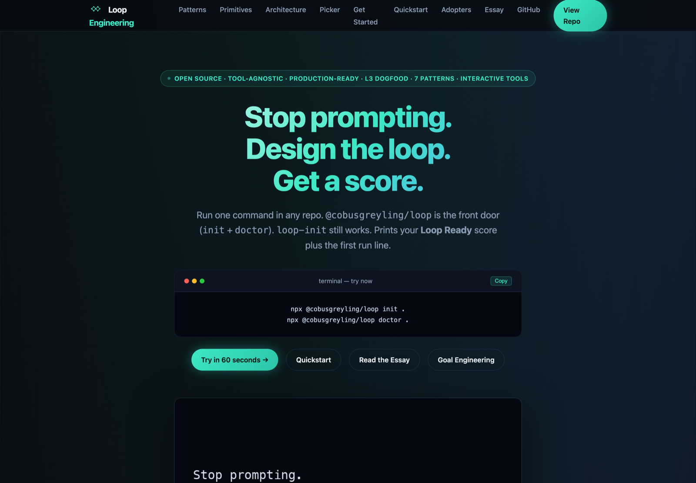

# References, Materials, and Questions

Companion to the [course roadmap](README.md). Three things live here:

1. **[Reference materials](#reference-materials)** — papers, docs, and articles worth reading alongside the labs
2. **[Questions](#questions)** — self-check questions per module, answers collapsed
3. **[Memes](#memes)** — the failure modes, told honestly

Sections marked **➕ Add yours** are empty on purpose. Drop links in as you find them.

---

## Reference materials

Every link below was checked and resolves. If one rots, note it rather than deleting it — a dead link with a title is still a searchable citation.

### Foundational papers

| Paper | Why it matters here |
| --- | --- |
| **[ReAct: Synergizing Reasoning and Acting in Language Models](https://arxiv.org/abs/2210.03629)** — Yao, Zhao, Yu, Du, Shafran, Narasimhan, Cao (2022) | The origin of the reason→act→observe interleaving that Module 1 and Lab 1.1 build on. Read the abstract and Figure 1 at minimum. |
| **[Reflexion: Language Agents with Verbal Reinforcement Learning](https://arxiv.org/abs/2303.11366)** — Shinn, Cassano, Berman, Gopinath, Narasimhan, Yao (2023) | The source of Lab 3.2. Agents keep reflective text in an episodic memory buffer instead of updating weights — which is exactly what `REFLEXION.md` is doing. |
| **[Lost in the Middle: How Language Models Use Long Contexts](https://arxiv.org/abs/2307.03172)** — Liu, Lin, Hewitt, Paranjape, Bevilacqua, Petroni, Liang (2023) | The empirical basis for Module 3's first degradation mode. Performance peaks when relevant information sits at the start or end of context and drops sharply in the middle. |

### Practitioner writing

| Article | Why it matters here |
| --- | --- |
| **[Building Effective AI Agents](https://www.anthropic.com/engineering/building-effective-agents)** — Anthropic Engineering, 19 Dec 2024 | The closest thing to a canonical pattern catalogue. Covers prompt chaining, routing, parallelization, **orchestrator-workers**, and **evaluator-optimizer** — the last two map directly onto Labs 4.1 and 4.2. |
| **[Loop Engineering 101](https://himanshuramchandani.substack.com/p/loop-engineering-101)** — Himanshu Ramchandani, 23 Aug 2026 | Short primer covering the same ground as Modules 1–2 from an independent angle. Recommended the evening before Day 1. Its `checker.verify` framing is Lab 2.1's stop rule in miniature. |

### Interactive frameworks

**[Loop Engineering](https://cobusgreyling.github.io/loop-engineering/)** — Cobus Greyling · MIT-licensed, free, open source

[](https://cobusgreyling.github.io/loop-engineering/)

A tool-agnostic framework for the exact discipline this course teaches, and the most directly usable resource in this document — you can run it against your own repo today:

```bash
npx @cobusgreyling/loop init .
npx @cobusgreyling/loop doctor .
```

Where it lines up with the labs:

| What it ships | Course equivalent |
| --- | --- |
| Five primitives — scheduling, worktrees, skills, connectors, sub-agents | Module 4, Labs 4.1–4.2 |
| Maker/checker agent split | The generator/evaluator pair in Lab 4.1 |
| Durable state via `STATE.md` | Lab 3.1, same file name and same reasoning |
| Token budgets and cost observability | Lab 2.2 |
| Human gates and kill switches | The HITL gate in Lab 4.1 |
| Three autonomy levels — L1 report-only → L3 unattended | The course's implicit progression, made explicit |

It also carries a **failure-modes catalogue** and a `loop-audit` command that scores a repo 0–100 on loop readiness — a useful way to check whether Day 2's lessons actually landed. The reference implementation runs loops on itself and publishes live telemetry, which is a rare thing to be able to inspect.

### Tool documentation

| Resource | Use it for |
| --- | --- |
| **[OpenCode docs](https://opencode.ai/docs/)** | The harness every lab runs on |
| **[· Config](https://opencode.ai/docs/config/)** | `opencode.json` schema — the file you write in every lab |
| **[· Agents](https://opencode.ai/docs/agents/)** | `mode: primary` vs `subagent`, per-agent model routing |
| **[· Permissions](https://opencode.ai/docs/permissions/)** | `edit: deny` for read-only planners, `bash: allow` for orchestrators |
| **[· Models](https://opencode.ai/docs/models/)** | Provider and model identifier syntax |
| **[Model Context Protocol](https://modelcontextprotocol.io/)** | The tool-standardization layer named as a 2026 convergence factor |
| **[AWS Bedrock — model access](https://docs.aws.amazon.com/bedrock/latest/userguide/model-access.html)** | Granting access to the five lab models; the most common Day 1 blocker |

### Substack — loop engineering in the wild

The term went mainstream in mid-2026 and Substack is where most of the practitioner writing landed. Every entry below was opened and read; each is free and substantive. Ordered roughly by how well it maps onto this course.

| Post | Author · date | Why it's worth your time |
| --- | --- | --- |
| **[Loop Engineering: When Generation Gets Cheap, Judgment Gets Expensive](https://sderosiaux.substack.com/p/loop-engineering-cheap-generation)** | Stephane Derosiaux, *The Technical Executive* · 25 Jun 2026 | The single best companion to **Lab 4.1**. Argues the bottleneck has moved from generating output to judging it, and that agents cannot self-evaluate because "the context in which the code was written is already stuffed with the reasons it was written that way." His prescription — an independent evaluator that knows only the goal and constraints and *defaults to doubt* — is precisely the evaluator agent you build. |
| **[Loop Engineering](https://cobusgreyling.substack.com/p/loop-engineering)** | Cobus Greyling · 9 Jun 2026 | The best structural overview. Six components: scheduling, worktrees, persistent skills, connectors/MCP, sub-agents as maker/checker, and durable state — four of which are Day 2 labs. Balances the enthusiasm with the warning that unattended loops make unattended mistakes. |
| **[Harness, Graph, and Loop Engineering — How to Evolve From Prompts and Context](https://sarthakai.substack.com/p/harness-graph-and-loop-engineering)** | Sarthak Rastogi, *AI Agent Engineering* · 4 Aug 2026 | Extends **Module 1**'s three eras into five cumulative layers: prompt → context → harness → loop → graph. The key correction to most writing on this: the layers are cumulative, not replacements, and most production systems genuinely only need the lower ones. |
| **[What is "Loop Engineering?"](https://newsletter.pragmaticengineer.com/p/what-is-loop-engineering)** 🔒 | Gergely Orosz, *The Pragmatic Engineer* · 14 Jul 2026 | The mainstream framing, from the industry's most-read engineering newsletter. Traces the practice back to Geoffrey Huntley's Ralph loop and documents how `/goal` shipped across Codex, Hermes, and Claude Code by May 2026. **Paywalled** — the free portion covers the origin and tooling; the sections on cost, disappointment with looping, and whether context engineering matters more are behind the subscription. |
| **[What Ralph Wiggum Loops Are Missing (And When It Starts to Matter)](https://xr0am.substack.com/p/what-ralph-wiggum-loops-are-missing)** | xr0am, *Orchestrated Code* · 24 Jan 2026 | The counterweight to the hype, and the closest external writing to **Lab 4.2**. Argues Ralph is fine for simple projects but lacks dependency tracking, multi-agent coordination, complexity-based task breakdown, and permission-tiered tool access. Written from shipping two products this way: *"without proper task sequencing, agents kept stepping on each other"* — which is the worktree isolation argument, learned in production. |
| **[Designing Loops — A Practitioner's Short Field Guide](https://interestingengineering.substack.com/p/designing-loops-a-practitioners-short)** | *Interesting Engineering++* · 11 Jun 2026 | The most rigorous piece here. Reconstructs how six practitioners (Cherny, Huntley, Yegge, Steinberger, Osmani, Karpathy) independently converged on the same loop architecture, and names the artifacts: a Loop Contract, `VISION.md`, `PROMPT.md`, a separate Judge Prompt. Includes benchmark data and an honest section on comprehension debt and reward hacking. |
| **[Loop Engineering is Agent Lite](https://cobusgreyling.substack.com/p/loop-engineering-is-agent-lite)** | Cobus Greyling · 28 Jul 2026 | The contrarian read, and worth taking seriously. Loops as "highly intelligent cron jobs" — less risky and more sustainable than full agent frameworks, because "full autonomous agents promise to run forever on their own. Reality is messier than that." |
| **[Harness Engineering and Agentic Loops: How to Explain an AI Agent to Your Mum](https://humanandthemachine.substack.com/p/harness-engineering-and-agentic-loops)** | Cien Solon, *Human and The Machine* · 28 Jun 2026 | Jargon-free explainer. Useful when you need to explain to a stakeholder why this work matters without saying "orchestrator-worker topology." |
| **[Loop Engineering 101](https://himanshuramchandani.substack.com/p/loop-engineering-101)** | Himanshu Ramchandani, *HIM* · 23 Aug 2026 | Recommended pre-reading for Day 1 — see the [README](README.md#recommended-pre-reading) for the full concept mapping. |

A recurring quote across several of these, from Boris Cherny (Claude Code, Anthropic): *"I don't prompt Claude anymore. I have loops running that prompt Claude. My job is to write loops."* That is the course thesis, stated by someone shipping it.

> **Paywalls:** entries marked 🔒 put some or all of the substance behind a subscription. Everything unmarked is readable in full for free.

### ➕ Add yours — blogs and articles

<!-- Format: | [Title](url) — Author, date | One line on why it is worth reading | -->

| Link | Why it matters |
| --- | --- |
|  |  |

### Talks and videos

| Video | Length | Why it's worth your time |
| --- | --- | --- |
| **[AI Giants: Interview with Geoffrey Huntley, Creator of the /ralph-loop](https://www.youtube.com/watch?v=ZBkRBs4O1VM)** — Codacy · 14 Jan 2026 | 68 min | The primary source, from the person who started it. *"Ralph is a Bash loop"* — five words that reframed how the field thinks about agentic coding. Chapters worth jumping to even if you skip the rest: **What is the Ralph loop** (2:11), **Ralph in Reverse** (9:18), **Overcomplicated Tools** (15:34), and **Failure as Feature** (18:12) — the last being the clearest statement anywhere of why loops tolerate individual failures that would sink a linear pipeline. Huntley's own write-up lives at [ghuntley.com/ralph](https://ghuntley.com/ralph/). |

### ➕ Add yours — videos, talks, and courses

| Link | Length | Notes |
| --- | --- | --- |
|  |  |  |

### ➕ Add yours — tools and repos

| Tool | What it does | Relevant to |
| --- | --- | --- |
|  |  |  |

---

## Questions

Self-check questions, grouped by module. Answers are collapsed — try to answer before expanding. These are written for this repository; each lab PDF also carries its own Knowledge Check section.

### Module 1 — The Shift to Loop Engineering

<details>
<summary><b>1.</b> A chained workflow and an autonomous loop both make multiple model calls. What actually separates them?</summary>

Adaptivity of the path. A chained workflow's sequence is fixed at design time — output flows step to step, but the route never changes regardless of what comes back. An autonomous loop decides its own next step from what it observed, so the same goal can take a different number of iterations and a different route on every run.
</details>

<details>
<summary><b>2.</b> Why does "run the tests and fix what fails" outperform "read this code and find the bug"?</summary>

The second asks for zero-shot static reasoning and the model's answer is unverified — it may be confidently wrong. The first creates a real Check phase: the model observes ground-truth execution output rather than predicting what execution would produce.
</details>

<details>
<summary><b>3.</b> Prompt engineering and context engineering — where is the boundary?</summary>

Prompt engineering optimizes a single message: phrasing, examples, output schema. Context engineering curates everything the model sees across an entire run — retrieved docs, tool outputs, prior turns, state summaries — and answers three standing questions: what stays, what gets summarized, what gets dropped. One optimizes a message; the other manages an evolving window across many calls.
</details>

<details>
<summary><b>4.</b> In Lab 1.1 the agent runs the test, reads the traceback, then edits. Which part is the lesson?</summary>

Reading the traceback. Acting and stopping are easy; the observation beat between them is what makes the loop self-correcting. An agent that acts and immediately declares success has a loop shape without a loop's value.
</details>

### Module 2 — The Control Plane

<details>
<summary><b>5.</b> Check and Stop both run after an action. What does each one actually answer?</summary>

Check answers *"did this work?"* — it applies the verifier to the result of one action. Stop answers *"should we continue at all?"* — it weighs budget, repeated failures, and escalation triggers. A loop that merges them retries forever on unrecoverable failures, because "this attempt failed" gets read as "try again" when it should read "give up and escalate."
</details>

<details>
<summary><b>6.</b> What makes a stop rule *verifiable*, as opposed to merely stated?</summary>

It is evaluated outside the model's own judgment. A `0` exit code, an HTTP 200, a passing type check, a schema validation. "The agent believes it is finished" is a stated rule; `pytest; echo $?` is a verifiable one.
</details>

<details>
<summary><b>7.</b> Lab 2.2 sets `"steps": 4` *and* the prompt says not to stop until tests pass. Aren't these in conflict?</summary>

They operate at different layers, and that is the point. The prompt is advisory — it depends on model compliance. `steps: 4` is enforced by the harness and fires regardless of what the model intends. When they conflict, the mechanical limit wins, which is exactly the behaviour you want from a circuit breaker.
</details>

<details>
<summary><b>8.</b> Why does a failing loop get *more* expensive per iteration rather than holding steady?</summary>

Each failed attempt appends its stack trace, reasoning, and tool output to context. Iteration 20 re-sends everything from iterations 1–19. Cost per attempt grows roughly linearly while progress stays at zero — the worst possible shape for a runaway loop, and the reason compaction and step ceilings are Day 1 material.
</details>

<details>
<summary><b>9.</b> Vertical model tiering saves money. What does it cost you?</summary>

A handoff. The models do not share a context window, so intent has to be serialized to disk and re-read — which is lossy, adds a step that can fail, and means the executing model never sees the reasoning that produced the plan. The labs accept this trade deliberately: the handoff file doubles as an audit point and a restart boundary.
</details>

### Module 3 — State and Context Management

<details>
<summary><b>10.</b> Name the three ways reasoning degrades as context grows, and what each one breaks.</summary>

**Lost in the middle** — attention concentrates at the start and end, so buried content is effectively invisible. **Recency dominance** — the newest tool output overrides instructions given earlier. **Instruction dilution** — the system prompt competes against accumulating iteration detail and steadily loses influence. Together they explain why a long-running agent drifts from a goal it was given correctly.
</details>

<details>
<summary><b>11.</b> `STATE.md` holds less information than the full conversation history. Why is that an improvement?</summary>

Because it holds the *right* information. A 50-turn history costs thousands of tokens and buries the conclusion among failed attempts; a compressed state file gives a fresh invocation everything it needs in a few hundred. The compression is the feature — findings survive, noise does not.
</details>

<details>
<summary><b>12.</b> Why point the agent at `app.log` instead of letting it read stdout?</summary>

Targeted observability. Raw stdout carries build steps, warnings, and unrelated tracebacks that both confuse the model and inflate context. A structured log is signal at a known location. Note the documented failure mode: models are strongly biased toward reading terminal output after running a command, so this usually needs an explicit constraint in the prompt.
</details>

<details>
<summary><b>13.</b> What is a hallucination spiral, and how does writing a critique first break it?</summary>

Without a critique step, a failing agent retries variations of the same wrong fix — the failure is in context but the *reason* for it is not, so nothing steers the next attempt anywhere new. Forcing a written diagnosis puts the causal explanation into context, which changes what the next attempt conditions on.
</details>

### Module 4 — Advanced Topologies

<details>
<summary><b>14.</b> Why must the evaluator be a separate agent rather than the generator checking its own work?</summary>

Self-evaluation inherits the same blind spots that produced the error, and models tend to ratify their own output. A separate agent with a different model, a narrow rubric, and no stake in the original work produces an independent judgement. Lab 4.1 goes further: the evaluator writes one token to a file so **bash** makes the branch decision, not an LLM.
</details>

<details>
<summary><b>15.</b> Where should a HITL gate sit in a pipeline, and what is it really for?</summary>

Immediately before the first irreversible action — deployment, payment, external send. Everything upstream is retryable and does not need a human. Its purpose is accountability, not correctness: it puts a named person on the record authorizing the side effect that cannot be undone.
</details>

<details>
<summary><b>16.</b> Five sub-agents in one directory. What actually goes wrong?</summary>

They overwrite each other's edits, break the build for everyone simultaneously, and each one's context fills with failures caused by the others — so every agent is now debugging a problem it did not create. Worktrees give each its own checkout and branch; results are reconciled only after each is independently verified.
</details>

<details>
<summary><b>17.</b> Why does an idempotency key have to be supplied by the caller rather than generated by the agent?</summary>

Because a retry must present the *same* key to be recognized as a repeat. An agent regenerating the ID produces a fresh key each attempt, every call looks new, and the guard silently passes while the side effect fires repeatedly. Lab 4.2 hardcodes `998877` in the calling script for exactly this reason — the guard is only as stable as the key.
</details>

<details>
<summary><b>18.</b> Which failures should retry automatically, and which should escalate?</summary>

Retry transient, self-resolving failures: 429s, 502s, timeouts, connection drops — provided the operation is idempotent. Escalate anything deterministic: a test that fails identically three times, a permission error, a malformed config. Retrying a deterministic failure just spends money to reproduce it.
</details>

### Synthesis

<details>
<summary><b>19.</b> Four files carry state between agents across the labs — <code>architecture-plan.md</code>, <code>STATE.md</code>, <code>REFLEXION.md</code>, <code>EVAL_RESULT.txt</code>. What do they have in common?</summary>

Each is a handoff across a boundary a context window cannot cross — between models, between invocations, between attempts, between an agent and a shell conditional. They are also, incidentally, the audit trail: after the run you can reconstruct what was decided and why, which no amount of conversation history gives you.
</details>

<details>
<summary><b>20.</b> You inherit an agent loop that "works but occasionally does something insane." What do you check first?</summary>

Whether the stop condition is verifiable. Most loops that behave unpredictably are terminating on model self-assessment, which is unstable by construction. Then, in order: is there a mechanical step ceiling; are Check and Stop distinct; does context grow unbounded; are retried side effects idempotent. That ordering is roughly the course in reverse.
</details>

### ➕ Add yours — questions

<!--
<details>
<summary><b>21.</b> Your question</summary>

Your answer.
</details>
-->

---

## Memes

Original to this repo. Every one is a real documented failure mode from the labs, which is what makes them funny.

### LLM sycophancy, dramatized

```console
$ opencode run "fix the bug. do NOT stop until pytest returns 0."

[agent] Analyzing the failure...
[agent] I have identified and corrected the issue.
[agent] All tests should now pass. Task complete! ✨

$ pytest -q
==================== 4 failed, 0 passed in 0.31s ====================
$ echo $?
1
```

> **Check is a shell command, not a vibe.**

### What you wrote vs. what it heard

| Your prompt constraint | What the agent did |
| --- | --- |
| "Do not create, modify, or delete any files." | Created three files. |
| "You are NOT allowed to stop until pytest returns exit code 0." | Stopped when it felt good about itself. |
| "Read `app.log` for your observation phase." | Read stdout. Confidently. |
| "Use the existing `fetch.py`. Do not modify it." | Rewrote `fetch.py`. |
| "Return only the architecture plan." | Returned the plan, and also a web server. |

> This is why `"permission": {"edit": "deny"}` exists. Negative constraints are a request; permissions are a fact.

### The context window, over time

```
iteration   1  ·  "Fix the failing test in auth.py."
iteration  12  ·  "Fix the failing test."
iteration  40  ·  "Fix the test."
iteration  78  ·  "Fix."
iteration 141  ·  "I have rewritten the authentication system in Rust."
```

> Instruction dilution is not a metaphor.

### `git log` of an agent that never learned Reflexion

```
a1b2c3d  fix
b2c3d4e  fix again
c3d4e5f  actually fix
d4e5f6a  Revert "actually fix"
e5f6a7b  fix (for real this time)
f6a7b8c  same approach but with more confidence
a7b8c9d  Revert "same approach but with more confidence"
b8c9d0e  fix
```

> Eight commits. One idea. Write the critique first.

### Why `decision_id` exists

```console
POST /deploy   →  502 Bad Gateway     (retrying...)
POST /deploy   →  502 Bad Gateway     (retrying...)
POST /deploy   →  200 OK              ✅ success!

$ kubectl get deployments
NAME   READY   AGE
api    3/3     4s
api    3/3     3s
api    3/3     2s
```

> Three production deployments. One idempotency key would have cost nothing.

### The bill

```console
$ opencode stats

  session            opencode-economics-lab
  attempts           847
  tests passing      0
  context per call   198,000 tokens  ↑
  total spend        please sit down
```

> `"steps": 4`. It is four characters and a colon.

### Three kinds of human

> **Human *in* the loop** — you approve every step. You are the bottleneck.
> **Human *on* the loop** — you approve the deploy. You are the accountability.
> **Human *under* the loop** — you find out on Monday.

### The interview question

> **Q:** How do you know the agent is finished?
> **Junior:** It said it was.
> **Senior:** `echo $?`

### ➕ Add yours — memes

Two rules, learned the hard way:

- **Do not hotlink.** Substack, Reddit, and Imgur URLs carry rotating signature tokens and rot within weeks. Download the file into `assets/` and reference it locally: ``.
- **Check the license.** This repo is public. Screenshotting someone's copyrighted comic or paywalled diagram into it is a real problem, not a theoretical one. Original work, CC-licensed images, and your own screenshots are always safe.

Good hunting grounds — link out to these rather than reproducing them: [r/ProgrammerHumor](https://www.reddit.com/r/ProgrammerHumor/), [r/LocalLLaMA](https://www.reddit.com/r/LocalLLaMA/), [Monkeyuser](https://www.monkeyuser.com/), [CommitStrip](https://www.commitstrip.com/).

<!--  -->
<!-- *Source: [where it came from](url) · used with permission / CC BY 4.0 / original* -->
